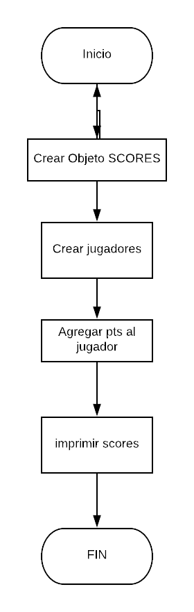

# DESCRIPCION
En este repositorio  se creara el siguiente ejercicio:

Imagina que estás jugando un juego con algunas amigas y quieres ir registrando el puntaje de cada una. Crea un object llamado scores donde los keys o propiedades son los nombres de tus amigas, y los valores serán los puntajes (todos empiezan con 0).

Escribe una función que toma dos argumentos, el nombre de tu amiga y la cantidad de puntos nuevos que ha obtenido, y que actualice los puntos de la jugadora en el object scores. También escribe una función que imprima en la consola el total de los puntos.

## INSTRUCCIONES BASICAS

Llevar registro del puntaje de cada jugador.

var scores={

name 1 : pts

name 2: pts

}

TODOS puntos  en 0

2 da parte

1. funcion (nombre y puntos)

2. Actualizar los puntos en el objeto (scores) 

3. Imprimir todos los puntos  en consola.

# PSEUDOCODIGO

1. Definir el objeto scores
2. Crear los jugadores
3. Agregar los puntos a cada jugador
4. Imprimir los scores de todos los jugadores

## Descripcion de pseudocodigo 
En esta parte se describe la funcional del proyecto descito en pasos .
1. Definir el objeto SCORES en el cual se almacenara toda la data

2. Crear los elementos Jugadores que se almacenaran como *keys*

3. Agregar el puntaje de cada jugador.

4. Imprimir toda la data que se encuentra almacenada en el objeto *SCORES*

## Elementos Funcionales

1. CreatePlayer(objeto.name), //* A donde va y cual es el nombre del * **key**
2. addPoints(name, pts), // *donde lo guardaras y su value pts*

# Diagrama de flujo

## Descripcion

### Diagrama de flujo del problema SCOREKEEPER

